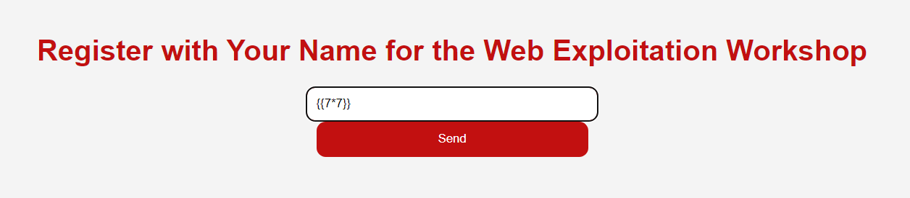
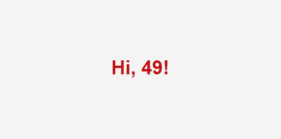
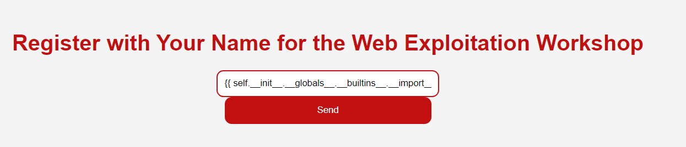
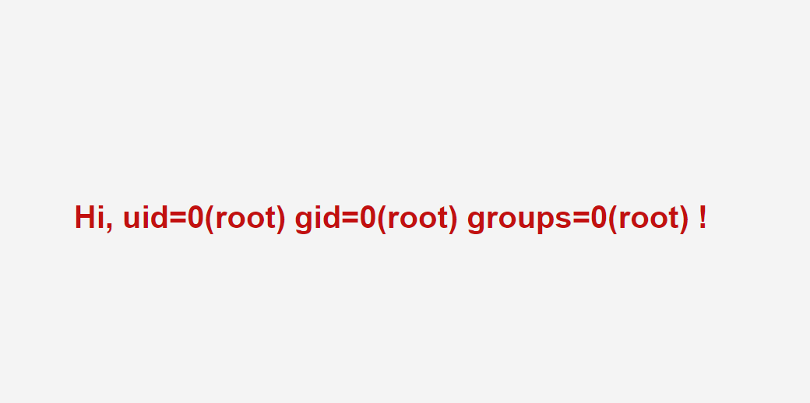
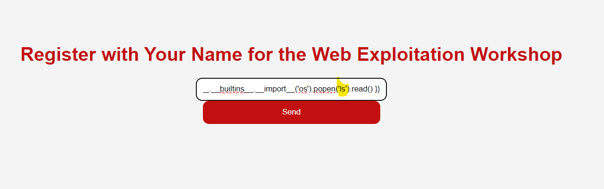
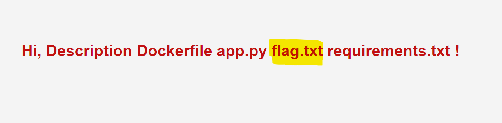
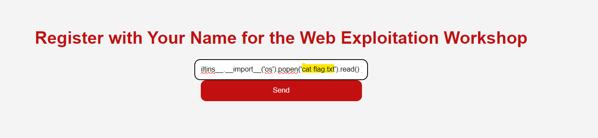
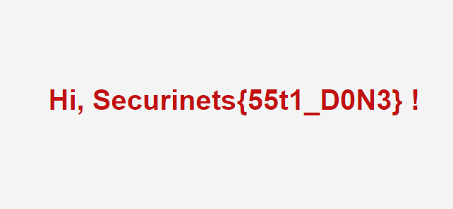

# SecuriNets ISI Friendly CTF 2023-2024

This writeup will guide you to solve the tasks:

- [Server Side Template Injection](#server-side-template-injection)
- [Local file inclusion 0 (LFI0)](#local-file-inclusion-0-lfi0)
- [Local file inclusion 1 (LFI1)](#local-file-inclusion-1-lfi1)

## Server Side Template Injection

### Confirmation of Jinja2 Usage

The title of this challenge, "Server Side Template Injection," coupled with the description, strongly suggests the use of the Jinja2 template engine in the web application. The mention of a Python web framework aligns with the fact that Jinja2 is commonly employed in Python web development.

### Supporting Argument

1. **Title Significance:** The inclusion of "Template Injection" in the title implies a vulnerability related to the rendering of templates on the server side. Jinja2 is a popular template engine in Python, making it a plausible choice for the web app's backend.

2. **Python Web Framework Hint:** The description hints at the web app being built with a Python framework. Considering Jinja2 is commonly used with frameworks like Flask and Django, it strengthens the case for Jinja2 being the template engine in play.

### Basic Jinja2 Injection Examples

In your research, you've uncovered some basic examples of Jinja2 SSTI, including:

- `{{4*4}}`: Evaluates to 16

#### Exploit Test

1. **Test Payload:** Jinja2 - Basic Injection Test.



   *Description: `{{7*7}}`*

2. **Test Result:** The application responds with the output of the '{{7*7}}' command.



### SSTI Exploit for Remote Code Execution (RCE)

After confirming the presence of SSTI in the web application, the next step is to exploit it for Remote Code Execution (RCE). One common payload for achieving RCE in Jinja2 is as follows:

```jinja
{{ self.__init__.__globals__.__builtins__.__import__('os').popen('id').read() }}
```

1. **Test Payload:** Exploit the SSTI by calling os.popen().read().



3. **Test Result:** The application responds with the output of the 'id' command.



   *Description: Confirm that the application responds with the output of the 'id' command, indicating successful SSTI execution.*

4. **Directory Listing**
   - **Payload:** Modify the payload to list the contents of the current directory using `ls`.



- **Test Result:** Execute the payload and observe the result to see the files and directories in the current location.



5. **Read Flag Contents**
   - **Payload:** Modify the payload to cat the contents of `flag.txt`.

     ```jinja
     {{ self.__init__.__globals__.__builtins__.__import__('os').popen('cat flag.txt').read() }}
     ```



- **Test Result:** Execute the payload and observe the result to read the contents of the `flag.txt` file: `Securinets{55t1_D0N3}`.



## Local File Inclusion (LFI0)

### Confirmation of Local File Inclusion

The title of this challenge, "Server Side Template Injection," coupled with the description, strongly suggests the use of the Jinja2 template engine in the web application.

### What is a Local File Inclusion (LFI) vulnerability?

> Local File Inclusion (LFI) allows an attacker to include files on a server through the web browser. This vulnerability exists when a web application includes a file without correctly sanitising the input, allowing and attacker to manipulate the input and inject path traversal characters and include other files from the web server.

